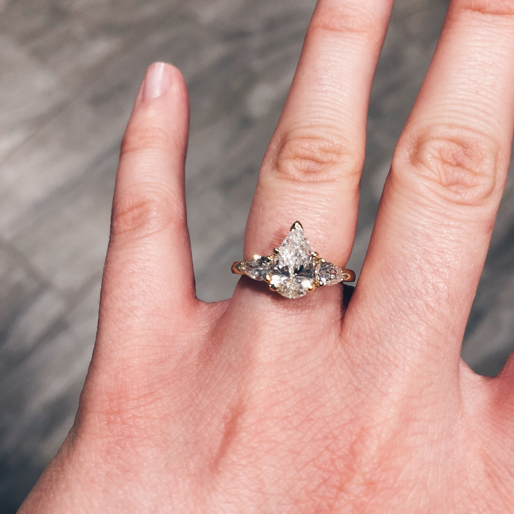

# Table of Contents

Jump around and discover faster.\

[Test to link out to IGN.](https://www.ign.com/reviews)

<figure><figcaption>
Ring!
</figcaption></figure>


test Youtube embed


Table of Contents

1. Book of Fun
2. Book of No Fun
3. Book of Beef Chow Fun
